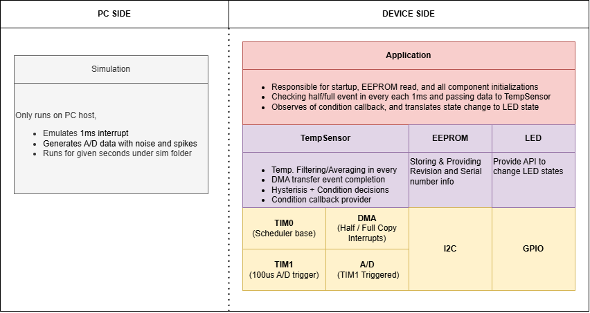
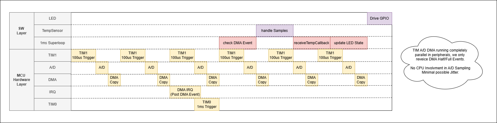
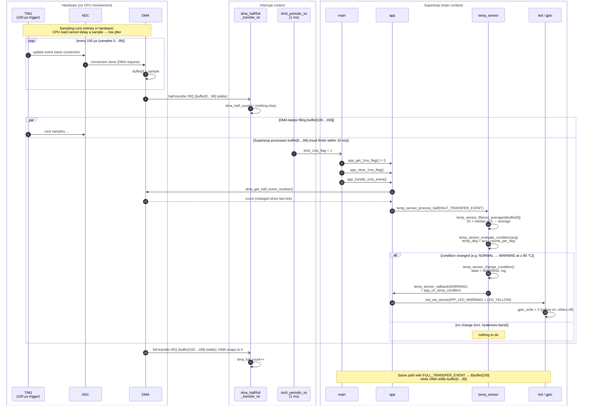

# Temperature Monitor

Bare-metal temperature monitor firmware, runnable on a PC with mocked hardware.

- The A/D converter is sampled every 100 µs by a timer trigger, and DMA copies
  the samples, so no CPU is involved and jitter is low.
- The temperature is filtered and mapped to one of three LEDs (green, yellow,
  red), with 2 °C hysteresis.
- The sensor revision (Rev-A / Rev-B) and serial number (`ABC1234`) are read
  from EEPROM over I2C.
- The firmware exists in two versions: C and C++ (OOP), and both give the same
  output.

## Repository layout

| Folder | Content |
|---|---|
| [main/0_fw](main/0_fw) | C firmware: `app`, `temp_sensor`, `eeprom`, `led` |
| [main/1_bsp](main/1_bsp) | C board support: `adc`, `dma`, `gpio`, `i2c`, `tim` (mocked for the PC) |
| [main/2_fw_cpp](main/2_fw_cpp) | C++ firmware: `AppOrchestrator`, `TempController`, `EepromController`, `LedController` |
| [main/3_bsp_adapt](main/3_bsp_adapt) | C++ interfaces and classes over the C BSP |
| [main/4_doc](main/4_doc) | Diagrams, design notes, ADRs |
| [main/5_bat](main/5_bat) | Build, run and clean scripts |
| [main/6_sim](main/6_sim) | PC simulation: 1 ms interrupt, A/D data with noise and spikes |
| [main/platform](main/platform) | Assert, log and barrier helpers |

## Documents





### Sequence: DMA half/full transfer → temperature → LED

One DMA cycle, from the hardware-triggered sampling to the LED update. The
full-transfer path is identical to the half-transfer one, with the other half
of the buffer.



- **Low jitter:** TIM1 → ADC → DMA is a hardware chain. The sampling instant does
  not depend on what the CPU is doing.
- **Short ISRs:** the DMA interrupts only count events. All processing runs in the
  superloop.
- **Double buffer:** the CPU processes one half while the DMA fills the other. A
  half must be processed within one half period (100 samples × 100 µs = 10 ms).
  It is picked up on the next 1 ms tick, so it starts at most 1 ms late.
- **Decoupling:** temp_sensor and led never call each other. temp_sensor reports a
  condition through a callback, and app decides which LED shows it.

### Document index

| Document | Content |
|---|---|
| [ComponentView.png](main/4_doc/ComponentView.png) | Layers and components, PC side vs device side |
| [Sequence.png](main/4_doc/Sequence.png) | TIM1 → A/D → DMA in hardware, 1 ms superloop, LED update |
| [sequence_half_full.md](main/4_doc/sequence_half_full.md) | DMA half/full transfer → temperature → LED (Mermaid) |
| [component_structure.md](main/4_doc/component_structure.md) | `_ifa` / `_inc` / `_cfg` file roles |
| [adr/README.md](main/4_doc/adr/README.md) | Index of architecture decision records |
| [ADR 0001](main/4_doc/adr/0001-condition-hysteresis.md) | 2 °C hysteresis on the temperature condition |
| [ADR 0002](main/4_doc/adr/0002-dma-half-full-sampling.md) | Timer-triggered A/D with DMA half/full interrupts |
| [ADR 0003](main/4_doc/adr/0003-component-structure.md) | Component structure |
| [ADR 0004](main/4_doc/adr/0004-bsp-adaptation-layer.md) | C++ adaptation layer over the C BSP |
| [ADR 0005](main/4_doc/adr/0005-interrupt-handlers-in-c.md) | Interrupt handlers stay in the C BSP |
| [ADR 0006](main/4_doc/adr/0006-no-heap-no-exceptions-no-rtti.md) | No heap, no exceptions, no RTTI |

## Build and run

Requirements: CMake ≥ 3.10 and a MinGW GCC toolchain (`gcc`, `g++`,
`mingw32-make`). If `gcc` is not on `PATH`, the scripts try `C:\MinGW\bin`,
`C:\msys64\mingw64\bin`, `C:\msys64\ucrt64\bin` and
`C:\ProgramData\mingw64\mingw64\bin`.

### Scripts

The scripts can be started from any folder; they always build into `build\`
at the repository root.

| Script | What it does |
|---|---|
| `main\5_bat\build_c.bat [Debug\|Release] [cmake args]` | Builds `build\bin\TempSensorFw.exe` (C) |
| `main\5_bat\build_cpp.bat [Debug\|Release] [cmake args]` | Builds `build\bin\TempSensorFwCpp.exe` (C++) |
| `main\5_bat\run_c.bat` | Runs the C build, building it first if missing |
| `main\5_bat\run_cpp.bat` | Runs the C++ build, building it first if missing |
| `main\5_bat\clean.bat` | Deletes `build\` |

The build type defaults to `Debug`. Anything after it goes to CMake unchanged,
for example:

```bat
main\5_bat\build_c.bat Release -DWERROR_ENABLE=OFF
```

The run scripts do not rebuild an existing executable; run the build script
after changing code.

### CMake directly

From the repository root:

```bat
cmake -S . -B build -G "MinGW Makefiles" -DCMAKE_BUILD_TYPE=Debug
cmake --build build --target TempSensorFw       &:: C
cmake --build build --target TempSensorFwCpp    &:: C++
build\bin\TempSensorFw.exe
```

### Options

| Option | Default | Effect |
|---|---|---|
| `CMAKE_BUILD_TYPE` | `Debug` | `Debug` or `Release` |
| `SIM_ENABLE` | `ON` | Builds [main/6_sim](main/6_sim) and starts it from `main()`; drives the mocked interrupts and A/D data |
| `WERROR_ENABLE` | `ON` | Treats compiler warnings as errors |

Simulation length, noise and spikes are set in
[main/6_sim/sim_cfg.h](main/6_sim/sim_cfg.h) (`SIM_RUN_MS` = 5600 ms, the set
point list twice).
