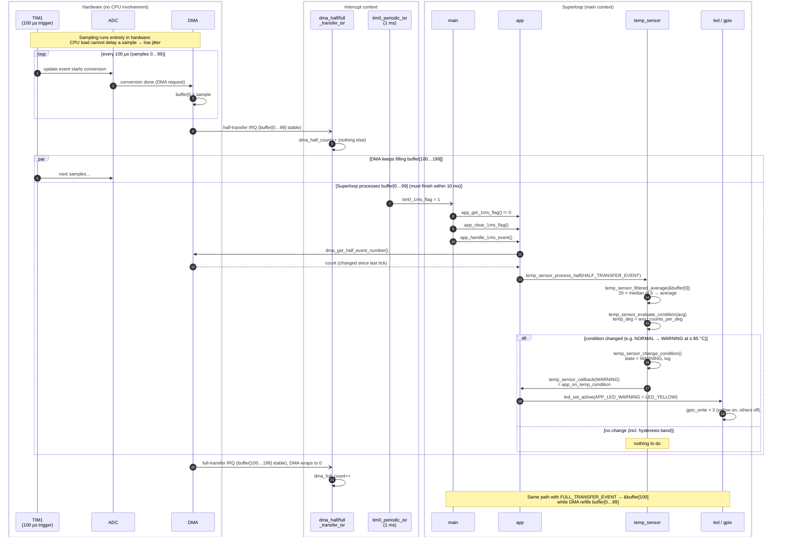

# Sequence: DMA half/full transfer → temperature → LED

One DMA cycle, from the hardware-triggered sampling to the LED update. The
full-transfer path is identical to the half-transfer one, with the other half
of the buffer.

## Notes

- **Low jitter:** TIM1 → ADC → DMA is a hardware chain. The sampling instant does
  not depend on what the CPU is doing.
- **Short ISRs:** the DMA interrupts only count events. All processing runs in the
  superloop.
- **Double buffer:** the CPU processes one half while the DMA fills the other. A
  half must be processed within one half period (100 samples × 100 µs = 10 ms).
  It is picked up on the next 1 ms tick, so it starts at most 1 ms late.
- **Decoupling:** temp_sensor and led never call each other. temp_sensor reports a
  condition through a callback, and app decides which LED shows it.
