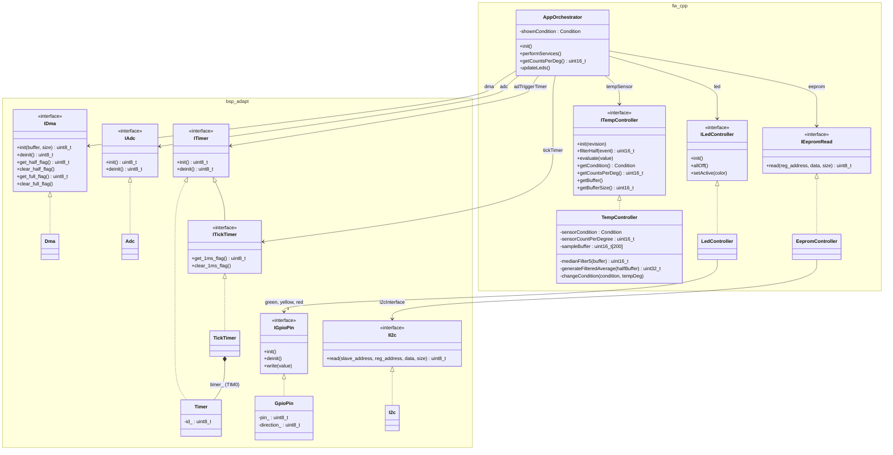

# C++ class diagram

Classes, interfaces and their dependencies in the C++ version. Every dependency
is a reference to an interface, passed in through the constructor. All objects
are static and wired in `app_dat.cpp`.

## Notes

- **Interfaces:** pure virtual, with protected non-virtual destructors and no
  copy. Objects are never deleted through an interface.
- **Adapters:** each `bsp_adapt` class forwards to the C BSP (`adc_init()`,
  `dma_get_half_flag()`, ...) through `extern "C"`. The interrupt handlers stay
  in the C BSP.
